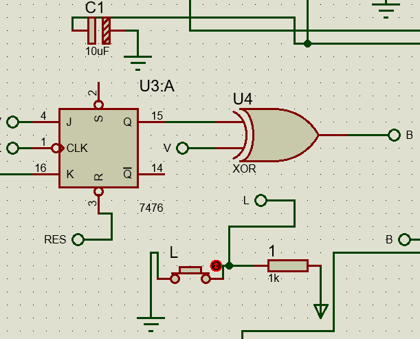
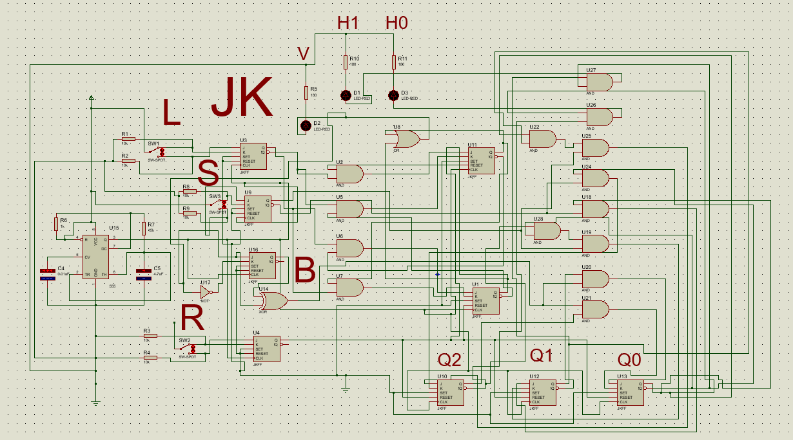

<br />
<div align="center">
	<a href="https://github.com/DarioArzaba/ProteusCircuitDesign">
		
	</a>
	<h3 align="center">Proteus Design</h3>
	<p align="center">
    	Proteus project files used to study and design electronic circuits.
  	</p>
</div>

## Installation

1. Buy or download the trial version of [Proteus](https://www.labcenter.com/) (At least version 8.13 SP0)
3. Clone the Repo
   ```sh
   git clone https://github.com/DarioArzaba/ProteusCircuitDesign.git
   cd ProteusCircuitDesign
   ```
4. Open, edit and run any of the `pdsprj` or `DNS` files provided.

</br>
<div align="center"> <p> JK Flip Flop example </p> </div>


* NOTE: Many simulations require `cof` and `hex` files to work, they can be generated through `c` and `asm` files in specialized software such as [MPLAB](https://www.microchip.com/en-us/tools-resources/develop/mplab-x-ide). A complete MPLAB project directory structure is provided under `MPLAB Source Code/Final Two Motor Car Synch`.

## License

Distributed under the [MIT License](https://mit-license.org/).

## Contact

Dario Arzaba - dario.arzaba@gmail.com